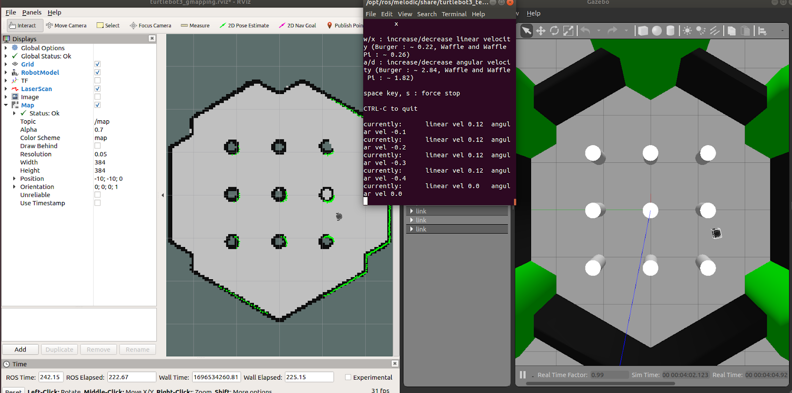
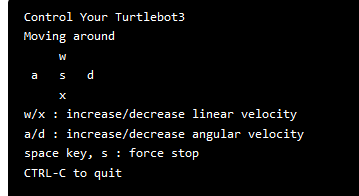

# Virtual Robotic Simulation Controls
## by Tim Lyons 10/13/2023
I work with Turtlebot3s and ROS hardware which are both Robotis Products for the Robotics and Machine Intelligence class. One of the major robotics problems is localization, finding out your position in space. We were learning a technique called SLAM (Simultaneous Localization and Mapping), where we map out an area and the software localizes itself to get the best approximation of where it is in a space given its surroundings. We can simulate this by running a 'world' in Gazebo, and what the robot sees in the SLAM window. My goal is to complete the lab as quickly as possible with quality work so I could have an extended lunch. 

After completing the bringup phase, ROS itself needs at least 3 windows visible at all times, which isn't **Satisfying** to look at considering they don't scale well if your rooms aren't vaguely hexagonal and small. The left window is what the robot sees, the middle terminal is the velocity control of the robot, and the right window is the simulated world. I don't  have any gripes with the right window currently as I haven't explored its features enough to say I know it.

The left robot vision window has a rather **inefficient** camera system as I learned trying to navigate around the pillars and not bump into walls. It was clearly designed for a mouse instead of a trackpad, much less a mobile laptop. The controls aren't labeled and there is no Clippy tooltip to help. Click & Dragging with the 'Move Camera' option rotates your camera around the center, not the robot, and does not move in the XY direction. With the Interact option enabled it does however move in the XY with a click & drag. The shortcut is a middle mouse button but I do not have one on my trackpad. Meaning as I am driving the robot I have to click over to the other window, move the camera and click back to the terminal which is annoying to do every 5-10 feet.

I found out that the scroll wheel and the 2 finger trackpad swipe zoom in and out which I expected but it becomes so small zoomed out that it is difficult to see the robot anymore. I looked around to try and find a feature that would help just to realize the camera system has no feature to follow the robot. So it could very well drive off the screen, meaning you have to stop it, move the camera, or just risk driving blind as you cannot control the robot and camera at the same time. This leads to **unsafe** usage of the robot which is demonstrated by me bumping into various pillars and walls. The focus camera button does not focus on a moving object but rather a point in space, similar to moving the camera in the XY direction but with 5 clicks. I believe adding a 'follow robot' feature that either just keeps the robot in the relative center region or locks you to the orientation of the robot (North Fixed or Body fixed like your car maps) would dramatically improve the **effectiveness** of the program.

The middle window of the command line interface, drives the robot, which is effective in maneuvering the robot after overcoming the learning curve. The classic convention is that most RC vehicle controls tend to turn the wheel and go forward/backwards, drive each wheel independently like a tank, or you would expect to hold a button to go in that vague direction. My expectations were based on my prior experiences, of which most followed the same convention. An example of my ideal robot controls based off my expectations and convention would be holding ‘a’ or ‘d’ to rotate, ‘w’ and ‘s’ to go forward backwards and stopping or slowing to a stop when I let the buttons go, perhaps ‘s’ would act as a brake to slow down and reverse after completely stopping. The actual system does not match classical system conventions. So after 30 minutes of my wheeling around haphazardly across simulation land, I manage to get some control by taking it low and slow, in order to have better accuracy of when to execute and stop my turns. You control the linear velocity in a direction and the angular velocity, adding or subtracting from that. So pushing ‘d’ once will make you spin right forever until you counteract the spin by pushing the ‘a’ key, perhaps multiple times to get back to 0 velocity if you pushed ‘d’ multiple times. The ‘s’ key resets all values to 0, and the ‘x’ key is how you subtract from the linear velocity and go backwards. 

The program definitely makes the program **memorable** with its constant reminder of what control does what and clearly printed linear and angular velocity values, until you squish the window too much and it newlines as shown in the first image.

Overall this made the overall experience difficult and frustrating as I had to spend more time figuring out how to control the screens and the robot than focusing on the meat of the lab, localization problems and more importantly my extended lunch was actually shortened

